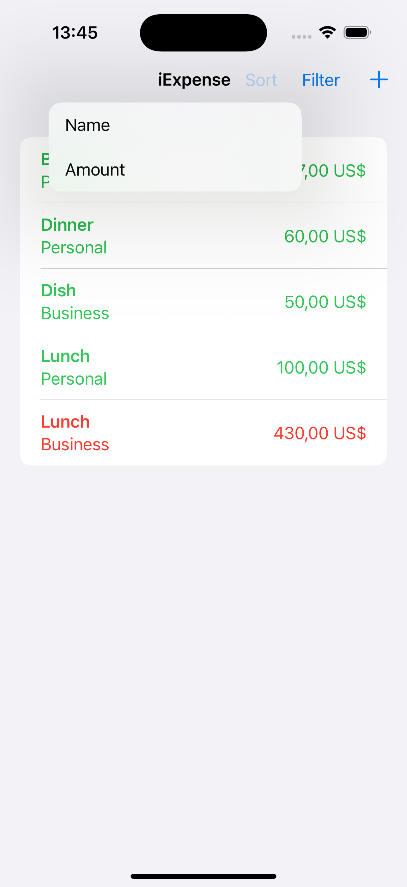
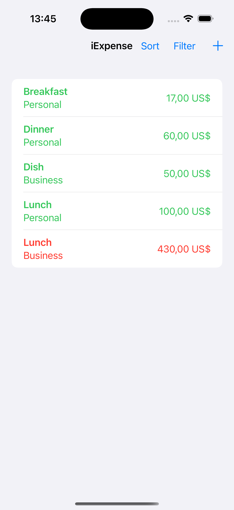
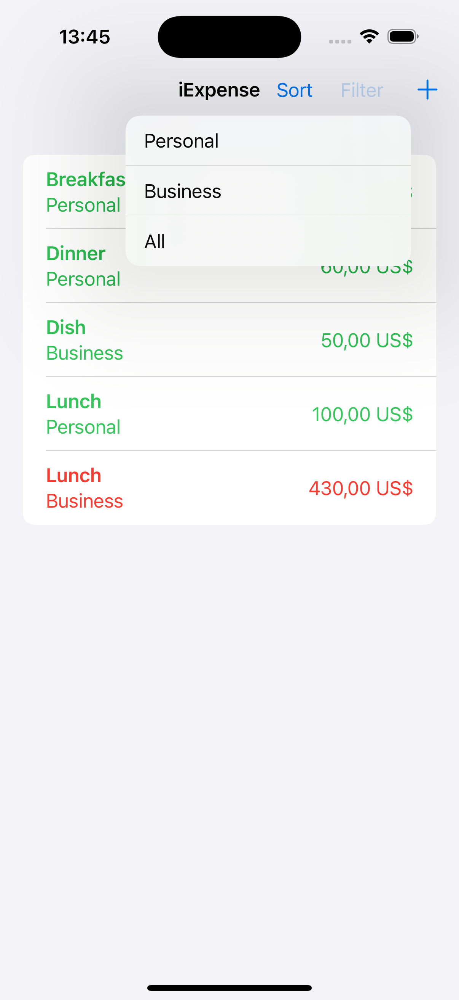
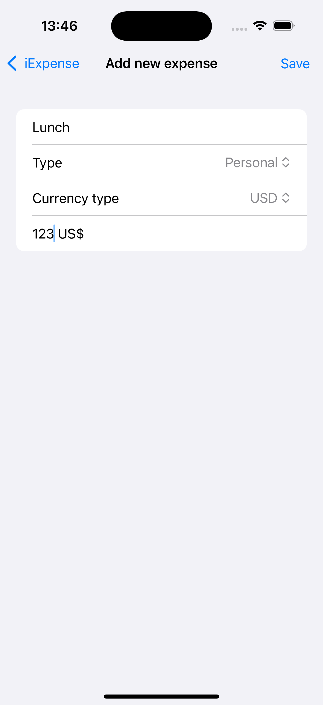
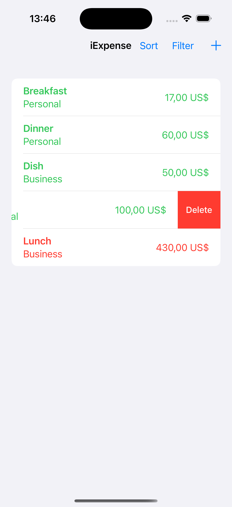

# iExpense
iExpense is an app to manage personal or business expenses with support for several currencies. Developed in SwiftUI, it allows to record, visualize and eliminate expenses, with data persistence using UserDefaults

## Features:
- Registration and organization of expenses in two categories: personal or business.
- Support for multiple currencies.
- Data persistence using UserDefaults and JSON encoding.
- Intuitive interface to add, visualize and delete expenses.

 
 
 
 
 
 

